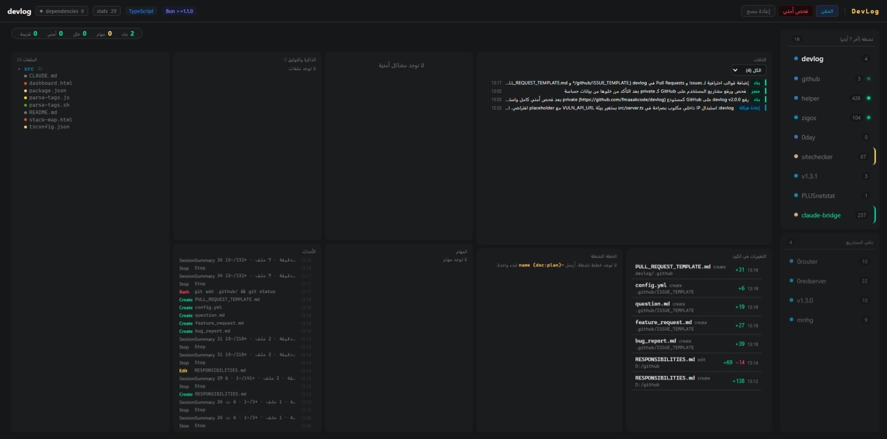

# DevLog

[](https://github.com/fmaaakcode/devlog/actions/workflows/test.yml) · **[Live demo →](https://fmaaakcode.github.io/devlog/)** · [Install](#install-claude-code-plugin--recommended)



Automatic development tracker for Claude Code projects. Claude emits short `-(tag)` markers in its responses; a Stop hook captures them and feeds a local dashboard with per-project activity, plans, releases, and security findings — without polluting any repo or filling Claude's context window.

## What you get

- A local web dashboard at `http://127.0.0.1:7777` showing every project Claude touches: built features, open todos, bugs, security findings, recent activity.
- Trackable plans (`doc:plan`) that Claude updates across sessions — checkboxes flip, progress bars move, all from chat.
- Auto-generated release reports grouping built/fixed/security tags by version.
- Generated `.md` + `.html` documents (reports, analyses, comparisons) without Claude writing HTML by hand.
- Lightweight context injection at session start so Claude knows what's already been done.

Zero npm dependencies — pure Bun + Node built-ins.

## Requirements

- [Bun](https://bun.sh/) 1.3.14+ (server runtime)
- [Claude Code](https://claude.com/claude-code) (any recent version with hooks support)

## Install (Claude Code plugin — recommended)

Inside Claude Code:

```
/plugin marketplace add fmaaakcode/devlog
/plugin install devlog
```

That's the whole install. The plugin bundles everything:

- **Hooks** ship inside the plugin (`hooks/hooks.json`) — no editing `settings.json`, no absolute paths.
- **The tag protocol** arrives as a compact SessionStart primer plus an on-demand `devlog-protocol` skill — nothing gets copied into your global `~/.claude/CLAUDE.md`.
- **The local server** auto-starts on first use (bundled `ensure-server.sh`); open the dashboard at `http://127.0.0.1:7777`.
- **Your data** lives in `~/.devlog/` — outside the plugin cache, so it survives every `/plugin marketplace update`.

Requires [Bun](https://bun.sh/) on your `PATH` (the plugin prints the one-line install command if it's missing). Update later with `/plugin marketplace update` — Claude Code handles it.

## Manual install (from a clone)

Prefer running from a checkout? Clone and start the server yourself:

```bash
git clone https://github.com/fmaaakcode/devlog.git
cd devlog
bun start
```

The server listens on `http://127.0.0.1:7777`. Open it in a browser to see the dashboard. (Empty until you wire the hooks below.)

To run with auto-reload during development: `bun dev`.

## Wire the hooks

Two hooks together give you the full system: **Stop** captures tags + enforces closure discipline + blocks `-(release)` while work is open. **PreToolUse** intercepts `gh release create` / `git tag -a v*` / `git push --tags` / `npm publish` / `cargo publish` to inject the changelog and refuse the command if any task is open.

Add this to your Claude Code settings (`~/.claude/settings.json` or per-project `.claude/settings.json`):

```json
{
  "hooks": {
    "Stop": [
      {
        "matcher": "",
        "hooks": [
          { "type": "command", "command": "bash /absolute/path/to/devlog/parse-tags.sh", "timeout": 15 }
        ]
      }
    ],
    "PreToolUse": [
      {
        "matcher": "Bash",
        "hooks": [
          { "type": "command", "command": "bash /absolute/path/to/devlog/pre-release-hook.sh", "timeout": 15 }
        ]
      }
    ]
  }
}
```

Replace `/absolute/path/to/devlog/` with the path where you cloned this repo. On Windows under Git Bash use the forward-slash form (e.g. `/d/code/devlog/parse-tags.sh`).

> **Do not set `"async": true` on the Stop hook.** Async fires-and-forgets, so the closure-check and release-guard can't actually block — they'd print warnings nobody reads. The 200–500 ms cost at the end of each turn is the price of real enforcement.

> **Why bash?** Claude Code passes the hook payload on stdin. The shell wrapper just hands it off to `bun *.js` — fully cross-platform.

After saving the settings, restart Claude Code. From now on, every response is scanned for `-(tag)` markers and every Bash release-ish command is gated.

### Upgrading from v2.3.x or earlier

If you already had DevLog wired and are pulling v2.4+, two changes to `~/.claude/settings.json` are required for the new enforcement system to actually block:

1. **Remove `"async": true`** from the Stop hook entry that runs `parse-tags.sh`. Async hooks fire-and-forget — they can't block the turn, so the new closure-check and release-guard would silently warn instead of enforcing.
2. **Add the PreToolUse entry** for `pre-release-hook.sh` (full snippet above). Without it, `gh release create` / `git tag -a v*` / `git push --tags` aren't intercepted, and a release can ship with open items via a Bash command path.

After editing, restart Claude Code. The dashboard's behavior is unchanged; only the enforcement layer activates.

### Disable / bypass

| Env var | Effect |
|---|---|
| `DEVLOG_CLOSURE_CHECK=0` | Stop hook still records tags but skips the closure fuzzy-match check. |
| `DEVLOG_RELEASE_GUARD=0` | Stop + PreToolUse stop refusing releases while items are open. Use for emergency hotfixes only. |
| `DEVLOG_INJECT_OFF=1` | Disables SessionStart / UserPromptSubmit context injection (independent of the enforcement above). |

### Diagnose

```bash
bun run doctor                  # checks current project
bun run doctor /path/to/other   # checks any project
bun run doctor --json /path     # machine-readable; exits 2 on critical findings
```

Runs the same checks the hooks use: stale open items, abandoned plans, git tags without `-(release)`, missing release notes, bugs/security shipped past a release, thin release commits, misleading plan names.

## Verify your setup

A quick sanity check after wiring the hook:

1. Make sure the server is running (`bun start`) and the dashboard at `http://127.0.0.1:7777` loads (empty is fine).
2. In any Claude Code session, finish a turn with a tag at the very end:
   ```
   -(note) testing DevLog setup
   ```
3. Refresh the dashboard within a couple of seconds — the note should appear under that project's recent activity.

If nothing shows up, look at `parse-tags.debug.log` (created next to `parse-tags.js`). Common causes: server not running on port 7777, hook path is wrong in `settings.json`, or `bun` isn't on PATH inside the bash environment Claude Code uses.

## Teach Claude the tag vocabulary

> **Plugin users:** skip this section. The plugin delivers the protocol automatically — a compact SessionStart primer teaches the core vocabulary, and the bundled `devlog-protocol` skill carries the full reference on demand. Nothing to copy.

**Manual install only.** The canonical tag protocol lives in [`skills/devlog-protocol/SKILL.md`](./skills/devlog-protocol/SKILL.md). Paste its content (or the relevant parts) into your `~/.claude/CLAUDE.md`. Without that, Claude won't know which tags to emit.

The minimum vocabulary is one line per concept:

```
-(built) added X
-(bug fix) X
-(todo) Y
-(done) Y
-(release) v1.0.0 — first cut
```

See the global instructions for the full set (plans, doc generation, security tracking, release workflow).

## Plans — two distinct things, similar names

Two unrelated mechanisms in this codebase share the word "plan". Don't confuse them.

### `-(plan)` — a free-text note

A plain tag whose content is a one-line description of what you intend to do. **Not trackable, not parsed, not closeable.** Treat it like `-(note)` with a "this is a plan I'm starting" hint.

```
-(plan) build login screen, then wire API, then settings
```

Stored as a tag, shown in the activity log, never grows checkboxes.

### `-(doc:plan)` — a trackable plan with GFM checkboxes

Generates a markdown + HTML document under `<project>/.devlog/docs/` and registers every `- [ ] step` as a tracked step. Steps are closeable from chat by emitting `-(done) <step text>` or `-(done) Pn` for a whole phase.

```
-(doc:plan) login-feature
# Login feature
### P0 — UI
- [ ] login page
- [ ] form validation
### P1 — Auth
- [ ] POST /api/login
- [ ] JWT issuance
```

Closing later:

```
-(done) login page         # closes one step (exact-text match)
-(done) P1                 # closes every open [ ] under "### P1 — ..."
-(dropped) JWT issuance    # removes the line entirely
```

**Behavior worth knowing:**

- Re-emitting `-(doc:plan)` with the same name **updates** the existing plan (preserves completion state for steps that already existed).
- `-(done)` flips `[ ]` → `[x]` in the `.md` file and re-renders the `.html`.
- `-(dropped)` deletes the line from the `.md` (cancellation, not unchecking).
- Step matching is case-insensitive and whitespace-tolerant; inline backticks in the tag content are ignored before comparing.
- Phase syntax (`-(done) P3`) only matches `### P3 — ...` headings literally — `### P3.1 — …` is a separate target.

For the full tag/closure rules, see the [`devlog-protocol` skill](./skills/devlog-protocol/SKILL.md) — the "Plans" and "Closure is mandatory" sections.

> **There is also a third "plan" concept:** Claude Code's own *Exit Plan Mode* output (saved at `~/.claude/plans/*.md` using `### 1.` numbered headings). DevLog's Stop hook ingests these too, via a separate parser (`src/plans.ts`). They appear in the "Active plan" widget alongside `-(doc:plan)` plans.

## Files

| File / dir | What it is |
|---|---|
| `src/server.ts` | HTTP + WebSocket server (port 7777) |
| `src/scanner.ts` | Project metadata scanner (langs, frameworks, files) |
| `src/tag-parser.ts` | Extracts `-(tag) content` blocks from Claude's response |
| `src/doc-store.ts` | `.md`/`.html` writer for `-(doc:*)` tags + GFM checkbox parser for trackable `-(doc:plan)` |
| `src/inject.ts` | Builds the SessionStart context block |
| `src/plans.ts` | Parses Claude Code's `~/.claude/plans/*.md` (Exit Plan Mode output, `### N.` style) — **not** for `-(doc:plan)` |
| `src/release-html.ts` | Per-release static HTML report |
| `src/data.ts` | JSON file storage with mutation lock |
| `parse-tags.js` | Stop hook entry — parses stdin, posts to `/api/tags`, runs closure-check + release-guard |
| `parse-tags.sh` | Shell wrapper for the Stop hook |
| `pre-release-hook.js` | PreToolUse hook — intercepts release-ish Bash commands, runs doctor + changelog briefing |
| `pre-release-hook.sh` | Shell wrapper for the PreToolUse hook |
| `src/doctor.ts` | Diagnostic CLI: stale items, abandoned plans, missing release notes, etc. |
| `src/closure-check.ts` | Fuzzy match between `-(built)`/`-(refactor)` content and open `#N` items |
| `src/version-writer.ts` | Auto-bumps `package.json` / `Cargo.toml` `version` field when `-(release) vX.Y.Z` arrives |
| `dashboard.html` | Single-file dashboard UI |
| `stack-map.html` | Cross-project tech-stack overview |

Runtime data lives in `.devlog-data/` (created on first run, gitignored).

## Auto-bumped manifests on release

When Claude emits `-(release) vX.Y.Z — …`, the server scans the project root for a manifest file and patches the version field in place:

| File | Field patched |
|---|---|
| `package.json` | `"version": "X.Y.Z"` (Bun / Node / npm / yarn / pnpm) |
| `Cargo.toml` | `version = "X.Y.Z"` under `[package]` (Rust) |

The write is atomic and uses an anchored regex — comments, formatting, key order, and unrelated `version =` lines under other sections (e.g. `[dependencies]`) are untouched. If no matching manifest exists, the release tag still goes through; only the bump is skipped. Same cwd-match guard as `doc:*` tags applies, so a release with a mismatched path can't patch a foreign repo.

## Library & vulnerability scanning

The "فحص أمني" / Scan button does two things, both built in — no external service, no API key, no extra process:

- **Outdated versions** — each dependency is checked against its ecosystem's official registry (npm, crates.io, PyPI, Go, Packagist), showing the latest version, its release date, and a ⏳ warning for releases newer than 7 days.
- **Known vulnerabilities (CVEs)** — each dependency, direct **and** transitive, is checked against [OSV.dev](https://osv.dev), reporting the advisory id, severity (CVSS computed from the vector), fix version, and summary. Run a full on-demand tree scan any time with the `-(audit)` tag; dismiss inapplicable advisories via `audit.toml` (Rust) or `.devlog/vuln-ignore`.

> An earlier build used an *optional external* Vuln API for CVE data. Since v2.9.6 vulnerability scanning is **native via OSV**, so setup stays a single process with no API key.

## Advanced features

Beyond tag capture and the dashboard basics, DevLog ships a set of deeper capabilities that aren't obvious from the main view. They're exposed over the local HTTP API (and surfaced in the dashboard via buttons/popups), all running inside the single Bun server — no extra process, no external service.

| Feature | What it does | Entry point |
|---|---|---|
| **Static code analysis** | A multi-language tokenizer + symbol extractor (`tokenizer.ts`, `symbols.ts`) feeds a project analyzer that maps HTTP routes, a function **call graph**, a module **dependency graph**, threads, IPC messages, data types, and security-sensitive patterns. | `GET /api/analyze`, `src/analyze.ts` |
| **Live process monitoring** | Lists active Claude Code sessions and builds the descendant **process tree** (Windows), so you can see — and kill — runaway PIDs from the dashboard. | `GET /api/processes`, `POST /api/kill-pid/:pid`, `src/sessions.ts` |
| **File-change tracking with diffs** | Records `old_string`/`new_string` for every edit Claude makes and renders an **inline diff** per change, per file, or per session. | `GET /api/changes`, `/api/changes/by-id/:id`, `/api/changes/session` |
| **Cross-project stack map** | A bird's-eye view of every project's languages, frameworks, and libraries, with a saveable layout. | `stack-map.html`, `GET /api/stack/:project`, `/api/stack/:project/layout` |
| **File-tree browser** | Walks a project tree to a given depth for in-dashboard browsing. | `GET /api/tree/:project`, `src/tree.ts` |
| **Export** | Dumps a single project (or all projects) to a portable JSON snapshot. | `GET /api/export/:project`, `/api/export-all` |
| **Injection preview & history** | Preview the exact SessionStart context block before it's injected, and inspect past injections. | `GET /api/inject/preview`, `/api/injections` |
| **Event retention** | Prunes old events under a retention policy while protecting closure-relevant items. | `src/retention.ts` |
| **Live updates** | The dashboard subscribes over WebSocket, so tags, builds, and process changes appear without a refresh. | `src/broadcast.ts` |

A visual tour of these lives in [`features.html`](./features.html) — open it in a browser, or serve it from the running server.

## Privacy

All your data stays local — the server only listens on `127.0.0.1`, and **no telemetry** is ever sent. The only outbound requests are **opt-out** dependency/vulnerability lookups (package names + versions → npm/crates.io/PyPI/Go/Packagist and [OSV.dev](https://osv.dev)) and an update check to GitHub Releases — metadata only, never your code or history. Turn them off with `DEVLOG_VULN_CHECK_DISABLED=1` and `DEVLOG_VERSION_CHECK_DISABLED=1`. Your activity history in `.devlog-data/` / `.devlog/` is git-ignored by the bundled `.gitignore` — keep it that way. See [SECURITY.md](./SECURITY.md) for the full threat model.

## Development

Environment variables for test isolation (no need to set in normal use):

| Variable           | Default                  | Purpose                                       |
| ------------------ | ------------------------ | --------------------------------------------- |
| `DEVLOG_DATA_DIR`  | `<repo>/.devlog-data`    | Override `.devlog-data` location (used by tests) |
| `DEVLOG_PORT`      | `7777`                   | Override server port (used by tests)             |

Run the test suite:

```bash
bun test
```

## License

MIT — see [LICENSE](LICENSE). Copyright (c) 2026 fmaaakcode.
