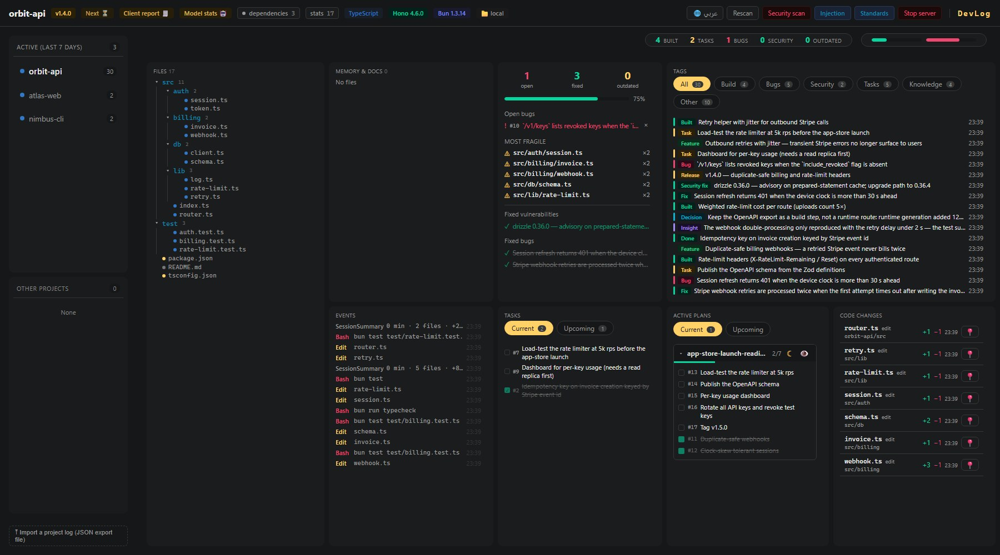

# DevLog

[](https://github.com/fmaaakcode/devlog/actions/workflows/test.yml) · **[Website →](https://fmaaakcode.github.io/devlog/)** · [Install](#install-claude-code-plugin--recommended) · [API](./API.md) · [Security](./SECURITY.md) · [Uninstall](#uninstall)



**A Claude Code plugin: the memory that doesn't live in the repo — with guardrails.**

Every Claude Code session ends and forgets: which approach you rejected and why, which bug was fixed and how, where the work stopped. DevLog captures that from a few short `-(tag)` lines Claude writes at the end of each response, hands it back to Claude *before* it repeats a mistake, and stops it at the moments that matter — no release with open work behind it, no dependency installed unchecked, no bug closed without a root cause.

Local dashboard, zero telemetry, zero runtime dependencies (pure Bun). Arabic and English UI.

```
/plugin marketplace add fmaaakcode/devlog
/plugin install devlog
```

That's the whole install (needs [Bun](https://bun.sh/) 1.3.14+ on your `PATH`). Details, manual install and uninstall are [below](#install-claude-code-plugin--recommended).

## The whole idea in two lines

Claude ends a response with tags like `-(built)`, `-(bug fix)`, `-(decision)`; a Stop hook captures them into a live per-project record — tasks, bugs, releases, decisions, all numbered and dated.

On top of the record: **guards** that block mistakes before they land, a **memory** that answers "have we been here before?", and a **dashboard** that shows it all. Everything runs on your machine — no cloud, no accounts, no external libraries.

```
… finished the login screen and wired it to the API.
-(built) login screen with field validation
-(todo) add a "forgot password" flow
-(bug fix) #12 — the token check ran before the session cookie was parsed
```

## Guards — 18 checks that refuse instead of warn

A guard is an automatic check that stops a mistake before it enters your record. Fifteen run on Claude's response before it closes; three sit on other gates. Every guard has a hit counter, so a silent guard is distinguishable from a dead one.

**Closure & honesty (5)** — so "done" means done

| Guard | What it stops |
|---|---|
| Empty closure | "Closed #12" when nothing is #12 — rejected, with the real open list |
| Mismatched closure | Right number, wrong item — rejected so the wrong item never closes |
| Work without closure | Finished an open task and forgot to close it by number — nudged before moving on |
| Root cause required | A bug can't be closed with a bare number; Claude must name *why* it happened. A knowingly temporary fix is recorded as visible debt (`bug fix:interim`) |
| Silent session | Wrote code and documented nothing — one reminder |

**Release (5)** — so you never ship a half-finished version

| Guard | What it stops |
|---|---|
| Open items block shipping | `-(release)` with open todos/bugs/security → refused until closed |
| Version never goes back | A version ≤ current is rejected; no duplicate release ever |
| Release syntax | Mixing a bump type with an explicit version in one tag → rejected with both correct forms |
| Feature reminder | A release with work but no client-visible `-(feature)` line → one soft reminder, never blocks |
| Server-side refusal | A second layer on the server itself, even if the local check is bypassed |

**Record hygiene (5)** — so the log stays clean

| Guard | What it stops |
|---|---|
| Typo'd tag | Not dropped silently — Claude gets the nearest valid tag and re-emits |
| Formatting trap | Tag written inside a code fence (treated as an example) → immediate hint to re-emit as a raw line |
| Disciplined deferral | Items can move to an "upcoming" tier that never blocks a release — but security is never deferrable |
| Phantom feature update | Updating/removing a feature by a number that matches nothing → stopped, shown the right list |
| Outdated libraries | Automatic warning at session start, before you ask |

**Three more gates**

| Gate | What it does |
|---|---|
| **Install gate** (PreToolUse) | Any `bun add X` / `npm i X` / `cargo add X` / `pip install X` without a pinned version is **blocked** before it runs — with the version DevLog recommends (newest stable ≥ 7 days old, clean in OSV.dev). Re-issue with the pin and it passes. `DEVLOG_INSTALL_GATE=strict` blocks when the check itself fails (offline) instead of silently allowing |
| **Write gate** (PreToolUse on Write/Edit) | Checks config files as they're written (toolchain versions, etc.) against the standards library; a violation stops and needs a deliberate confirm |
| **Load-bearing wall gate** | The first time Claude touches a file that ≥ 5 other files depend on, it's stopped once: "this is a load-bearing wall — here's what sits on it." Doesn't prevent demolition; prevents *unaware* demolition. If Claude proceeds without recording a reason (`decision`/`insight` in the same session), one non-blocking nudge asks for it |

Bypass knobs for emergencies: `DEVLOG_RELEASE_GUARD=0`, `DEVLOG_CLOSURE_CHECK=0`, `DEVLOG_ROOTCAUSE_CHECK=0`, `DEVLOG_DEMOLITION_GATE=0`, `DEVLOG_STANDARDS_CHECK=0`. Every bypass is deliberate — nothing slips through by oversight.

## Libraries — safety first

| | |
|---|---|
| **No blind installs** | See the install gate above. Not advice — an actual block |
| **Version advisor** | Before any new dependency Claude emits `-(ask:lib) <name>` and gets the exact version to install: newest stable at least 7 days old and clean in [OSV.dev](https://osv.dev). No guessing, no `@latest` |
| **Vulnerability scan** | The full dependency tree — direct *and* transitive — against OSV.dev, for npm, Rust, Python, Go, PHP, and mixed projects (e.g. Tauri). On demand via `-(audit)`; dismiss inapplicable advisories with `audit.toml` (Rust) or `.devlog/vuln-ignore` |
| **Same-session alert** | A severe advisory appears for a library installed in *this* session? The warning reaches Claude on the next message, not tomorrow |
| **Outdated report** | Session start lists libraries that fell behind their official registry (npm, crates.io, PyPI, Go, Packagist) |
| **"Why this library?" page** | `/deps.html`: every dependency with the purpose Claude recorded (`-(lib) name — purpose`), its official description, and its security status. Overriding a warning is recorded as an open security item — it doesn't vanish |

## Tasks, bugs, plans

Everything open gets a `#N` that follows you across sessions — open today, close next week.

- **Tasks** open with `-(todo)`, close with `-(done) #N` or withdraw with `-(dropped) #N`. Live list any time with `-(ask:open)`.
- **Bugs** open with `-(bug found)`, close with a root cause. A bug that comes back after its "fix" is flagged automatically with ⟲ — regressions don't pass quietly.
- **Security** items have their own lane: never deferrable, never shipped open.
- **Plans** (`-(doc:plan)`) are checkbox documents whose boxes flip themselves as steps close — see [Plans](#plans--two-distinct-things-similar-names).
- **Upcoming tier** — deferred ideas in their own tab; kept, but they never block a release.
- **Test nudge** — fixed a bug without touching a test file? One reminder to pin the fix.

## Memory — "have we been here before?"

Your record becomes something you can ask, so you don't re-open an old debate or repeat a solved mistake.

| Ask | What you get |
|---|---|
| `-(ask:search) <question>` | Best-matching stored tags — decisions, insights, closed bugs with their fixes — served in the same turn. `all:` prefix searches every tracked project |
| *(automatic)* | Opened a bug that resembles a closed one? The old fix, its number and files arrive without being asked |
| *(automatic)* | Claude opens a file with history? A short brief arrives first: what happened here, what was fixed, which decisions shaped it |
| `-(ask:why) <path>` | The full dossier for one file: purpose, decisions, every bug that touched it and how it ended (⟲ if the fix didn't hold), latest work. Pull it **before** rewriting a wired-in file, so Claude doesn't propose a solution the project already rejected |
| `-(ask:map) [focus]` | The code map: files ranked by how much the rest depends on them, each with the purpose its own header states. Use before grepping an unfamiliar area |
| `-(decision)` | Every architectural decision is stored *with the rejected alternative and why it lost* — "why didn't we pick X?" has a documented answer |
| *(stored)* | Each fix keeps the model's reasoning at the time; ask a year later and it's still there, even if the session files are gone |
| *(stored)* | Every tag carries the name of the model that wrote it — "who made fix #N?" has an answer |

## The narrative layer — what happened, and why it was asked

The record used to store *what* was done, not *why it was requested* or *what happened along the way*. Three pieces close that gap:

- **`-(ask:recent) [N | Nd]`** — the time door. A summary of the last session (its tags in order, files touched with edit sizes, commands and which failed, its story if any). `3` = last 3 sessions, `7d` = last week. Pull it when picking up old work instead of digging through raw data.
- **Your literal request** — with every documentation batch, the user's own prompt (≤ 700 chars) is stored and linked to its tags. It shows in file dossiers and session summaries, so "why was this asked for?" is answered in your words, not the model's interpretation.
- **`-(story)`** — after a batch that closes two or more items, one nudge asks Claude for the *turning points only*: an approach that failed, a change of direction, a deliberate deferral (≤ 1200 chars, one per batch, no re-telling of tags). Linked to the closed numbers and stamped by an evidence check: a claim like "we tried X and it failed" with no trace in the session's events is marked *unsupported*.

## Session-start briefing

Every new session, Claude receives a compact briefing so it never starts from zero: the project's identity and stack, the last five things built, open items with their numbers, alerts (outdated libraries, vulnerabilities, record damage, a stale server), and which standards it can pull — all under an enforced size cap so the start never bloats. Preview the exact block at `GET /api/inject/preview`.

## Standards library

Rules captured from your corrections, pulled on demand by language or app type (`-(ask:rules) typescript security`), added with `-(rule:add)`. Each rule gets a before/after effect measurement (see below), so you know which rules actually changed anything.

## Dashboard — everything above, live

`http://127.0.0.1:7777`, updated over WebSocket without a refresh:

- **Per-project panels** — tasks, bugs, security, releases, memory, and a "most broken" section showing which files keep failing.
- **Stack map** — an interactive picture of the code's structure and who depends on whom.
- **Change viewer** — every edit Claude made, as an inline diff per file or per session.
- **Release pages** — a static HTML page generated for every release with its changes.
- **Client report** — one button: a report you can send to a client — capabilities and latest release, no internals, no security details.
- **Model comparison** — which model opens more bugs, whose fixes hold, who ships without tests — from your real record.
- **Trends** — monthly curves of opened, closed and released across the whole history.
- **Studies** — `-(ask:study)` generates a deep study from the entire history; each study builds on the previous one.
- **Arabic / English** — the 🌐 button flips the whole UI and remembers your choice.

## Releases — one command

Emit `-(release) <reason>` and DevLog does the rest: detects the bump type, computes the version, writes the changelog, generates the release page, and patches the version field in `package.json` / `Cargo.toml` in place (atomic, anchored regex — nothing else in the file is touched). Every client-visible capability declared with `-(feature)` accumulates in a features registry, backfillable to past releases.

## Your data doesn't get lost

- **Archive, never delete** — old events roll into monthly compressed archives; every `undo` keeps a copy first, and if the copy can't be written the deletion is refused.
- **Daily backups** of project settings.
- **Move between machines** — export any project's history as one JSON bundle and import it elsewhere with duplicate-skipping merge.
- **Doctor** — `bun run doctor [path] [--json]` finds corruption, duplicates, stale items, abandoned plans, releases shipped past open bugs; recent findings also surface at session start.
- **`-(ask:record)`** — audits the record itself for entries captured wrongly (swallowed prose, fragments, drifted shape); fixes only with your approval, entry by entry, archiving the original first.

## Self-measurement

The tool measures itself — by counting and comparing, no built-in AI (the mind reading the numbers is Claude):

- **Rule effectiveness** — added a rule? Bugs before vs after: helped / no change / worse / not enough data yet.
- **Guard counters** — how often each guard blocked, how often it was deliberately overridden, and which silent one needs a check.
- **Backed or talk?** — every "I did X" claim is stamped: real file traces = *backed*; none = *no trace*.

## Install (Claude Code plugin — recommended)

Inside Claude Code:

```
/plugin marketplace add fmaaakcode/devlog
/plugin install devlog
```

That's the whole install. The plugin bundles everything:

- **Hooks** ship inside the plugin (`hooks/hooks.json`) — no editing `settings.json`, no absolute paths.
- **The tag protocol** arrives as a compact SessionStart primer plus an on-demand `devlog-protocol` skill — nothing gets copied into your global `~/.claude/CLAUDE.md`.
- **The local server** auto-starts on first use (bundled `ensure-server.sh`); open the dashboard at `http://127.0.0.1:7777`.
- **Your data** lives in `~/.devlog/data/` — outside the plugin cache, so it survives every `/plugin marketplace update`.

Requires [Bun](https://bun.sh/) 1.3.14+ on your `PATH` (the plugin prints the one-line install command if it's missing). Update later with `/plugin marketplace update`. Set `DEVLOG_LANG=ar` for Arabic protocol messages.

## Manual install (from a clone)

```bash
git clone https://github.com/fmaaakcode/devlog.git
cd devlog
bun start            # or: bun dev  (auto-reload)
```

The server listens on `http://127.0.0.1:7777`; data lives in `<repo>/.devlog-data/` (gitignored). Then wire the hooks: copy the entries from [`hooks/hooks.json`](./hooks/hooks.json) into `~/.claude/settings.json` (or a project's `.claude/settings.json`), replacing `${CLAUDE_PLUGIN_ROOT}` with your clone path (forward slashes on Windows under Git Bash, e.g. `/d/code/devlog`). Minimal shape — the two hooks that make everything else work — with `/d/code/devlog` standing in for your clone:

```json
{
  "hooks": {
    "SessionStart": [{ "hooks": [{ "type": "command", "command": "bash \"/d/code/devlog/ensure-server.sh\" --plugin", "timeout": 20 }] }],
    "Stop": [{ "hooks": [{ "type": "command", "command": "bash \"/d/code/devlog/parse-tags.sh\"", "timeout": 30 }] }]
  }
}
```

Add the rest from `hooks/hooks.json` the same way. The full set is:

| Event | Hook | Role |
|---|---|---|
| `SessionStart`, `UserPromptSubmit` | `ensure-server.sh --plugin` | keeps the server alive, injects the briefing |
| `PreToolUse` · `Bash\|PowerShell` | `pre-release-hook.sh`, `pre-install-hook.sh` | release guard, install gate |
| `PreToolUse` · `Write\|Edit` | `pre-standards.sh` | write gate |
| `PreToolUse` · `Read` | `curl … /api/inject` | file brief before Claude reads a file with history |
| `PostToolUse`, `Stop`, `Subagent*`, `Task*` | `curl … /api/hook` | event capture (changes, commands, sessions) |
| `Stop` | `parse-tags.sh` | tag capture + all response guards |

> **Do not set `"async": true` on the Stop hook.** Async fires-and-forgets, so nothing can block — the guards would print warnings nobody reads. The 200–500 ms at the end of each turn is the price of real enforcement.

Manual installs also need the protocol: paste [`skills/devlog-protocol/SKILL.md`](./skills/devlog-protocol/SKILL.md) (or its relevant parts) into your `~/.claude/CLAUDE.md`. Plugin users skip this.

### Verify

1. Server running, dashboard loads (empty is fine).
2. End a Claude turn with a raw line: `-(note) testing DevLog setup`
3. Refresh — the note appears under that project.

Nothing? Set `DEVLOG_DEBUG=1`, retry, and read `.devlog/parse-tags.debug.log` next to `parse-tags.ts`. Usual causes: server not on 7777, wrong hook path, `bun` not on PATH inside the bash Claude Code uses.

## Uninstall

Removing the plugin does not stop the server or delete your data — those are deliberate (data outlives plugin updates), so removal is three explicit steps:

1. **Plugin** — inside Claude Code: `/plugin uninstall devlog` (manual installs: delete the hook entries from `settings.json` and the protocol from `CLAUDE.md`).
2. **Server** — it keeps running until stopped: `curl -X POST http://127.0.0.1:7777/api/server/stop` (or `-H "X-DevLog-Token: …"` if you enabled `DEVLOG_REQUIRE_TOKEN`), or just kill the `bun src/server.ts` process. If you registered the optional Windows supervisor task: `schtasks /delete /tn DevLogGuard /f`.
3. **Data** — the whole record lives in **`~/.devlog/`** (plugin mode) or `<repo>/.devlog-data/` (manual clone). Delete that directory and it is gone — nothing is stored anywhere else on your machine, and nothing was ever sent off it. Per project, DevLog may also have written a `<project>/.devlog/` folder (generated docs, release pages, `DEVLOG_STATUS.md`); delete it if you don't want to keep them.

Environment variables you set yourself (`DEVLOG_LANG`, `DEVLOG_DATA_DIR`, `DEVLOG_PORT`, the `*_DISABLED` switches) are yours to unset; DevLog never writes to your shell profile or the registry.

## Plans — two distinct things, similar names

- **`-(plan)`** — a free-text note. Not trackable, not closeable. Like `-(note)` with a "starting this" hint.
- **`-(doc:plan) <name>`** followed by markdown with `### P0 — …` phases and `- [ ] step` lines — a **trackable** plan. Generates `.md` + `.html` under `<project>/.devlog/docs/` and registers every step. Close from chat with `-(done) <step text>` (exact, case/whitespace-tolerant) or `-(done) P1` (whole phase); `-(dropped) <step>` removes the line. Re-emitting the same name updates the plan and preserves completed steps.
- Claude Code's own *Exit Plan Mode* output (`~/.claude/plans/*.md`) is ingested too, by a separate parser (`src/plans.ts`), and shows in the same widget.

Full rules: the [`devlog-protocol` skill](./skills/devlog-protocol/SKILL.md).

## Privacy

All data stays local — the server listens on loopback only (`127.0.0.1` / `::1`), and **no telemetry** is ever sent. The only outbound requests are **opt-out** lookups of package names + versions (npm / crates.io / PyPI / Go / Packagist and OSV.dev — the dependency sweep, the `-(ask:lib)` advisor, the install gate, and the standards gate's toolchain check) and an hourly update check against GitHub Releases — metadata only, never your code or history. Switch off with `DEVLOG_VULN_CHECK_DISABLED=1`, `DEVLOG_REGISTRY_CHECK_DISABLED=1`, `DEVLOG_VERSION_CHECK_DISABLED=1` — with all three set, nothing leaves your machine. Host-by-host table and full threat model: [SECURITY.md](./SECURITY.md). Removing everything: [Uninstall](#uninstall).

## Development

```bash
bun test              # suite (isolated: DEVLOG_DATA_DIR + DEVLOG_PORT forced via preload)
bun run lint          # Biome
bun run typecheck
bun run doctor [path]
```

Code map: [`API.md`](./API.md) (every HTTP route by module) · [`CONTRIBUTING.md`](./CONTRIBUTING.md) (red lines, language policy) · `stack-map.html` (live dependency map).

## License

MIT — see [LICENSE](LICENSE). Copyright (c) 2026 fmaaakcode.
